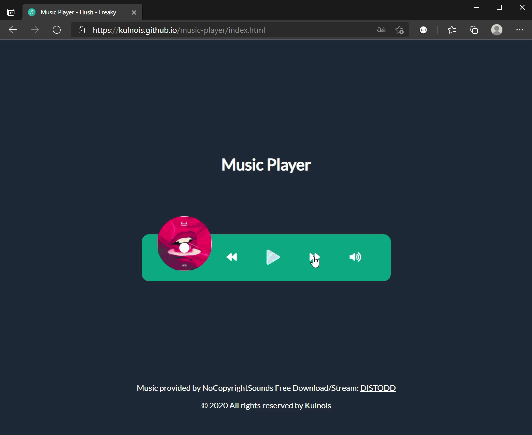

# [Music Player](https://kulnois.github.io/music-player/index.html)

Reproductor de música creado en html, css y javaScript.

[Ver](https://kulnois.github.io/music-player/index.html).

### Recursos

* HTML
* CSS
* JS
* Para las cancones uso [DISTODD](http://NCS.io/DISTODD)

## Instalación
1. [Download](../../archive/master.zip) o clonar el repositorio.